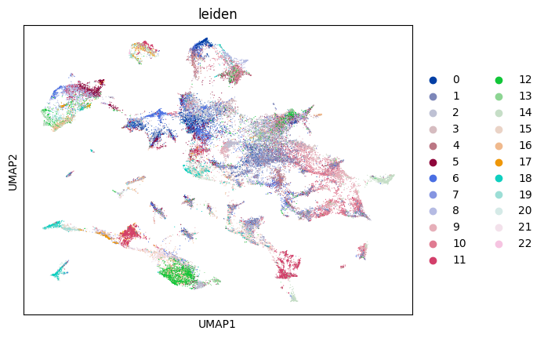
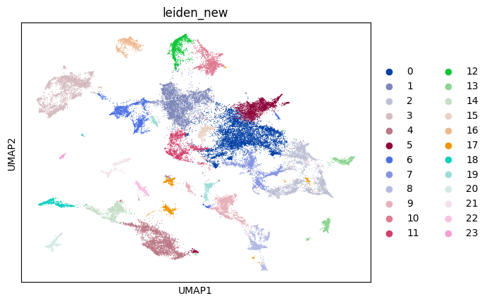
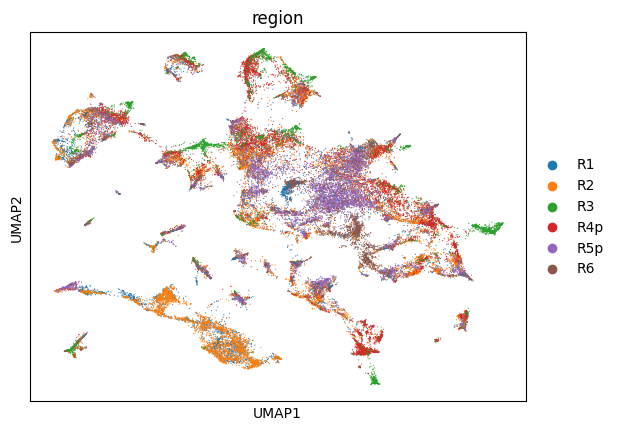
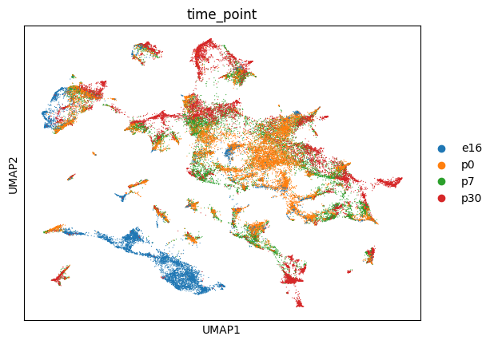
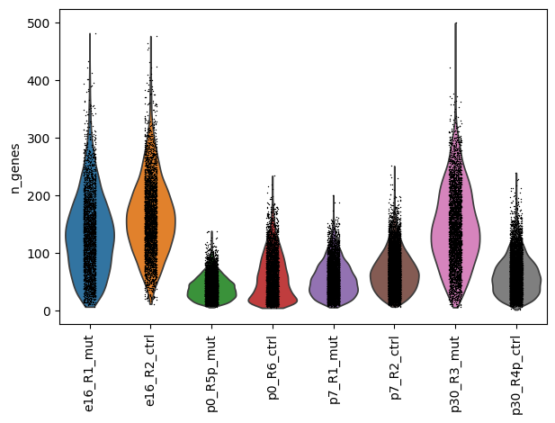
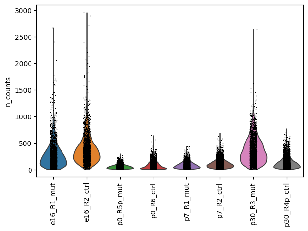
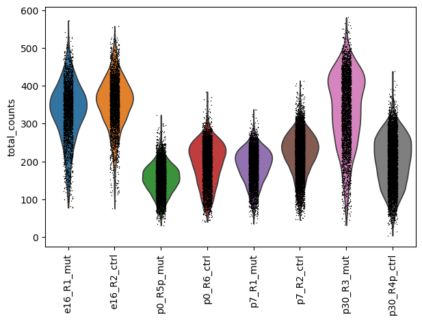

## Code Summary: 1_merge_hippo.py

It merges spatial transcriptomics data from hippocampus regions across different time points and experimental conditions. 
It combines data from multiple ROIs that have been classified as hippocampus tissue.

**Data Processing:**
- Merges all AnnData objects using outer join
- Calculates quality control metrics (n_genes, n_counts, total_counts)
- Performs dimensionality reduction (PCA, UMAP)
- Computes cell neighborhoods and performs Leiden clustering
- Generates sample identifiers combining time point, region, and type

### Outputs

**1. Quality Control Plots** (saved to `MERGE_SPATIAL_DATA/plots_hippo_inclusive/`):
- `_qc_violin_n_genes.png` - Distribution of gene counts per sample
- `_qc_violin_n_counts.png` - Distribution of UMI counts per sample  
- `_qc_violin_total_counts.png` - Distribution of total counts per sample

**2. UMAP Visualization Plots:**
- `_leiden_clusters.png` - Cells colored by original Leiden clusters
- `_leiden_new_clusters.png` - Cells colored by new Leiden clusters (resolution 0.5)
- `_time_points.png` - Cells colored by developmental time points
- `_regions.png` - Cells colored by anatomical regions

**3. Merged Dataset:**
- `MERGE_SPATIAL_DATA/merged_spatial_data_hippo_inclusive.h5ad` - Combined AnnData object containing all hippocampus cells with:
  - Gene expression data
  - Spatial coordinates
  - Metadata (time_point, region, type, sample_id)
  - QC metrics
  - Dimensionality reduction results (PCA, UMAP)
  - Clustering results
        
### UMAP Visualizations

### Quality Control Metrics

