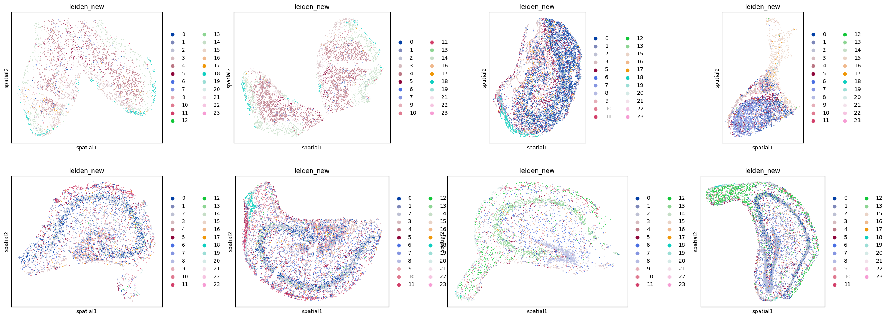

## Code Summary: 2_hippo_analysis.py

### Key Functionality

1. **Cluster Analysis**
   - Analyzes cluster sizes per sample (categorizes as small <50 cells vs large ≥50 cells)
   - Performs inclusive analysis - includes ALL clusters regardless of size
   - Generates summary statistics for each sample

2. **Visualization Generation**
   - Creates spatial scatter plots showing Leiden clusters faceted by sample
   - Generates individual spatial plots for each sample
   - For each sample-cluster combination, creates dual plots:
     - **UMAP plot**: Shows cluster highlighted in color against gray background
     - **Spatial plot**: Shows cluster's spatial distribution with coordinates

### Outputs

1. **Plot Files** (saved to `MERGE_SPATIAL_DATA/plots_hippo_cluster_highlight_inclusive/`):
   - `spatial_leiden_by_sample.png` - Overview of all clusters by sample
   - `spatial_leiden_by_sample_{sample_id}.png` - Individual sample plots
   - `sample_{sample}_cluster_{cluster}.png` - Dual UMAP/spatial plots for each cluster

2. **Summary Report**:
   - `inclusive_analysis_summary.txt` - Text file containing:
     - Cluster counts per sample (small vs large)
     - Total clusters analyzed across all samples
     - Confirmation that all clusters were included in analysis

3. **Console Output**:
   - Cluster size analysis for each sample
   - Overall summary statistics        
        
### Spatial Leiden New By Sample

