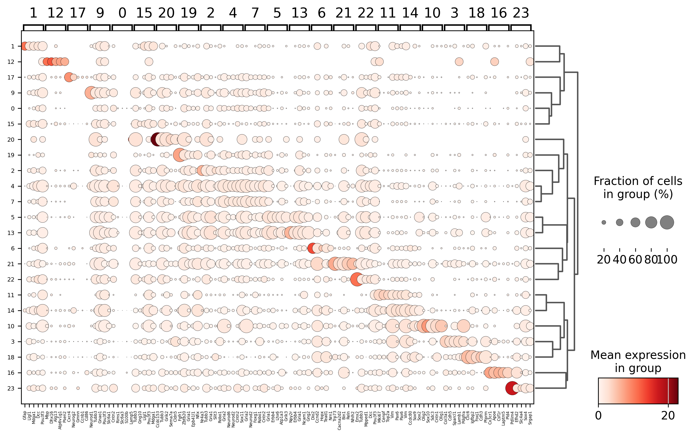
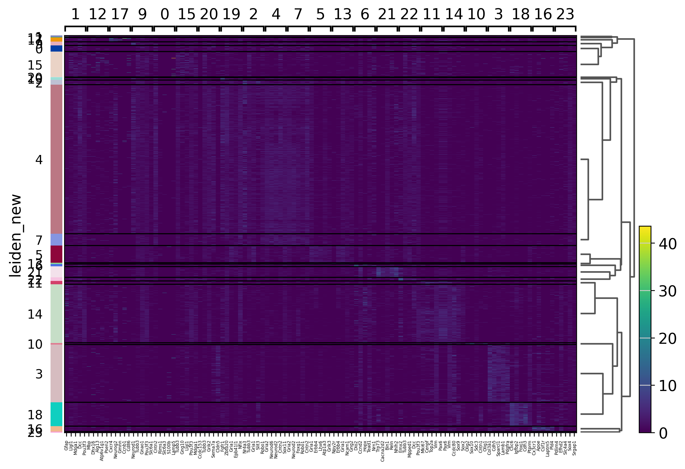
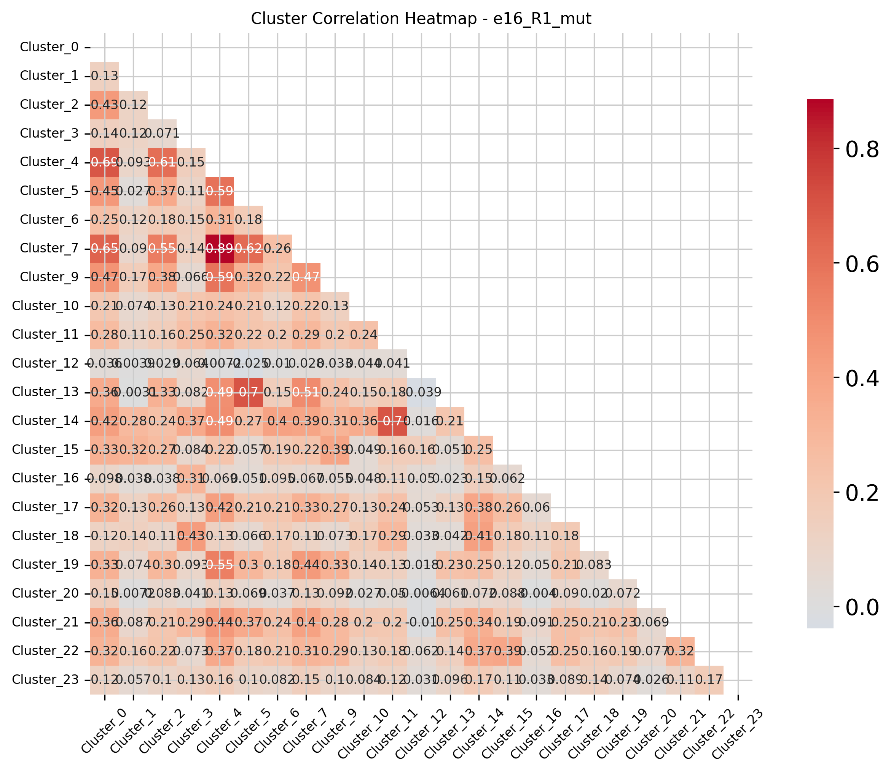
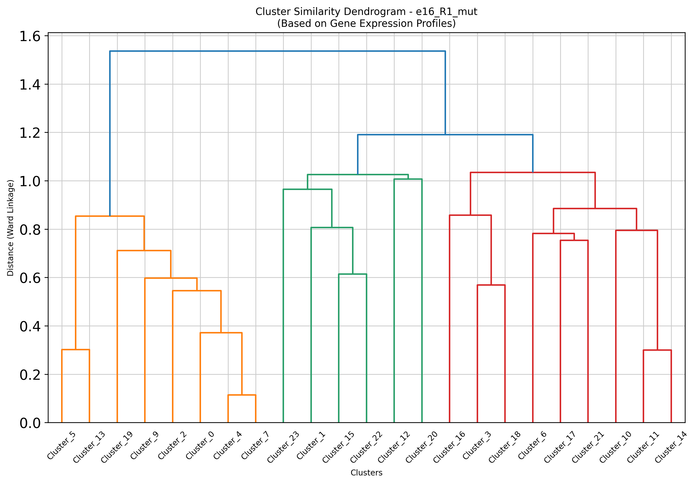

## Code Summary: 3_marker_genes_per_sample.py
          
Marker gene analysis and cluster similarity analysis on merged spatial transcriptomics data, designed to analyze each sample individually within a combined dataset.

### Main Purpose:
- Identify marker genes for each cell cluster within each sample
- Perform cluster similarity analysis between clusters
- Generate visualizations and reports for each sample

### Key Functionality:

1. **Sample-wise Analysis**: Processes each sample separately to:
   - Perform Wilcoxon rank-sum test to find marker genes
   - Extract top 30 marker genes per cluster

2. **Differential Expression Analysis**:
   - Uses `scanpy.tl.rank_genes_groups()` with Wilcoxon method
   - Compares gene expression between clusters within each sample
   - Identifies top 50 marker genes per cluster

### Outputs Generated:

**Per Sample (in `MERGE_SPATIAL_DATA/marker_genes_per_sample_inclusive/sample_{ID}/`):**
- `marker_genes.csv` - Complete marker gene results with statistics
- `top_30_marker_genes.csv` - Top 30 marker genes per cluster
- `heatmap_{sample_id}_marker_genes_heatmap.png` - Heatmap visualization
- `dotplot_{sample_id}_marker_genes_dotplot.png` - Dotplot visualization
- `{sample_id}_cluster_dendrogram.png` - Hierarchical clustering dendrogram
- `{sample_id}_cluster_correlation.png` - Cluster correlation heatmap
- `{sample_id}_correlation_matrix.csv` - Correlation matrix data
- `{sample_id}_summary.txt` - Sample-specific analysis summary

**Overall Summary:**
- `overall_sample_statistics.csv` - Statistics across all samples
- `overall_analysis_summary.txt` - Complete analysis summary
               
        
### Sample Analysis Visualizations

#### Marker Gene Expression

#### Cluster Analysis

