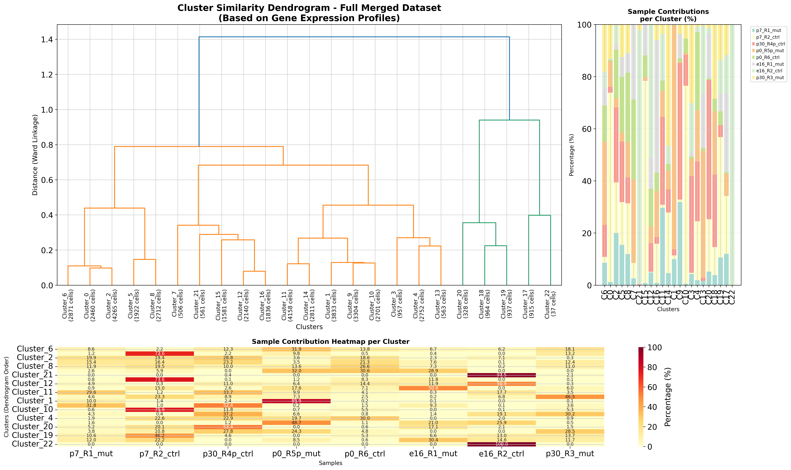
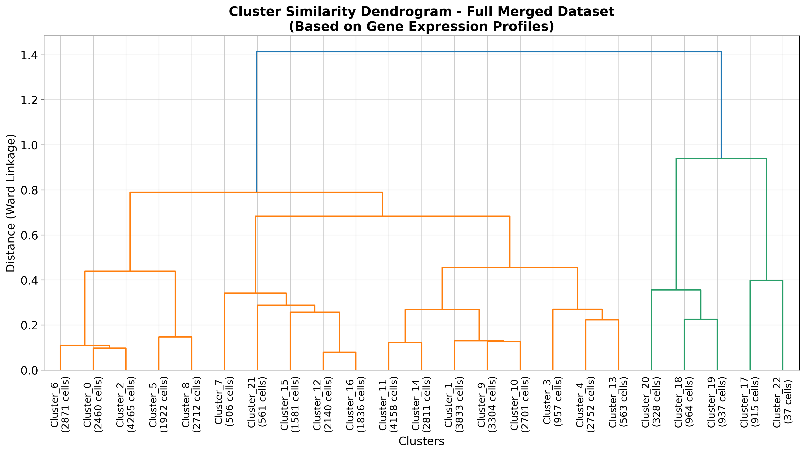
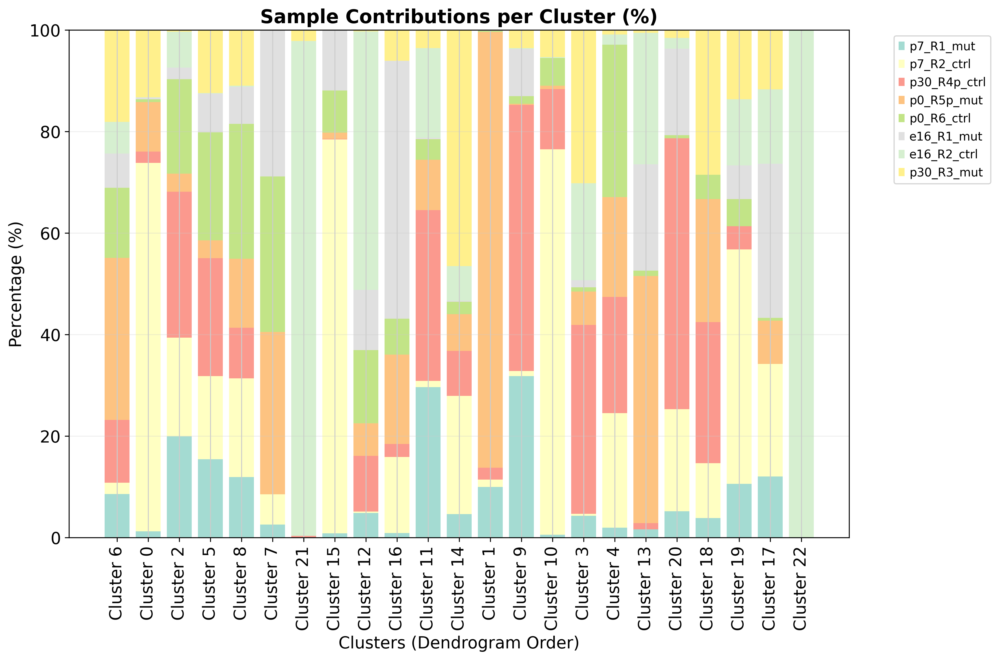
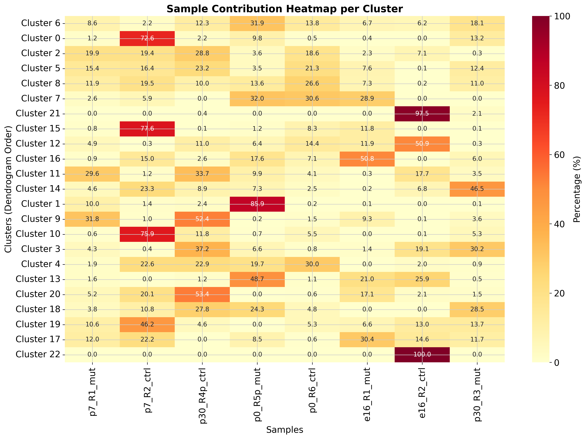
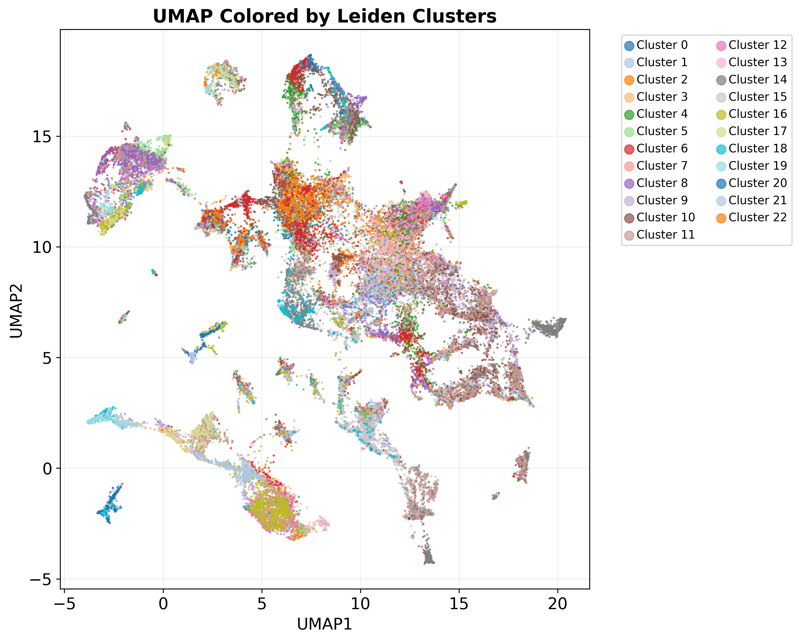
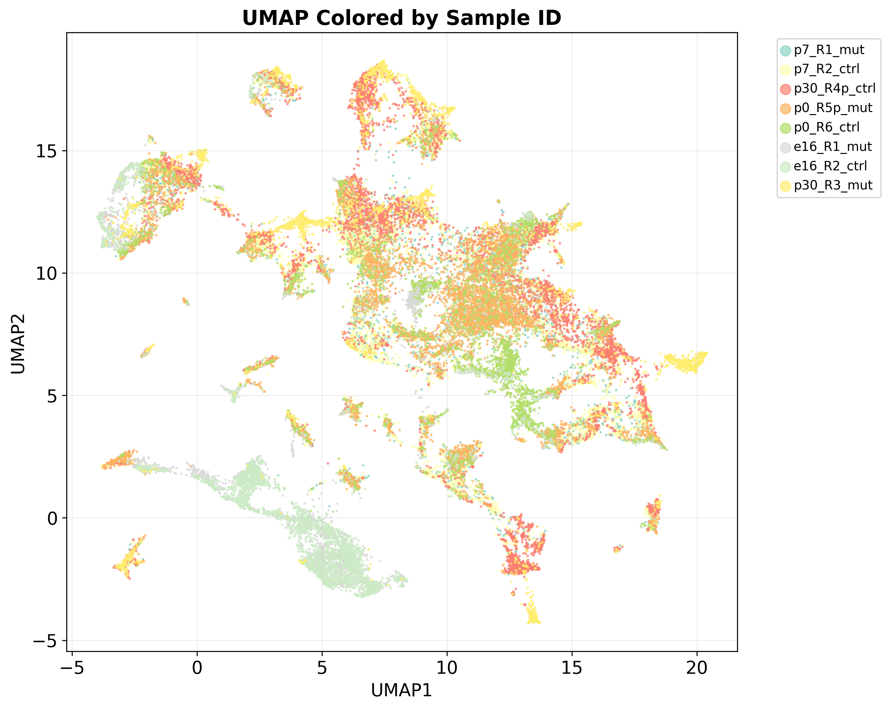
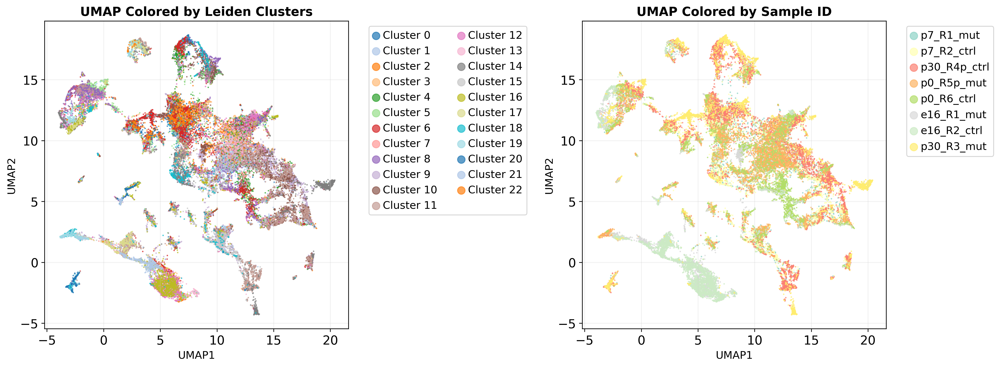

## Code Summary: merged_dataset_dendrogram_with_sample_contributions.py

Hierarchical clustering analysis on merged spatial transcriptomics data, creating dendrograms and analyzing how different samples contribute to each cluster.

### Key Functionality

1. **Sample Contribution Analysis**
   - Calculates percentage contribution of each sample to every cluster
   - Creates detailed statistics on cluster composition
   - Generates sample-cluster contribution matrices

2. **Hierarchical Clustering**
   - Calculates mean gene expression profiles for each cluster
   - Performs hierarchical clustering using correlation distance and Ward linkage
   - Creates dendrogram showing cluster relationships based on expression similarity

3. **Visualization**
   - **Combined plot**: Dendrogram + sample contribution bars + heatmap
   - **Standalone dendrogram**: Cluster similarity tree
   - **Sample contribution bars**: Stacked bars showing sample percentages per cluster
   - **Contribution heatmap**: Color-coded matrix of sample contributions
   - **UMAP plots**: Dimensionality reduction colored by clusters and samples

### Outputs

1. **Main Visualization Files** (saved to `MERGE_SPATIAL_DATA/merged_dataset_dendrogram_analysis/`):
   - `merged_dataset_dendrogram_with_sample_contributions.png` - Combined analysis plot
   - `standalone_dendrogram.png` - Hierarchical clustering tree
   - `standalone_sample_contribution_bars.png` - Stacked bar chart
   - `standalone_sample_contribution_heatmap.png` - Contribution heatmap
   - `umap_clusters_and_samples.png` - Side-by-side UMAP plots
   - `standalone_umap_by_clusters.png` - UMAP colored by clusters
   - `standalone_umap_by_samples.png` - UMAP colored by samples

2. **Data Export Files**:
   - `cluster_sample_contributions.csv` - Detailed contribution data
   - `sample_summary_statistics.csv` - Per-sample statistics
   - `cluster_summary_statistics.csv` - Per-cluster statistics
   - `hierarchical_clustering_linkage_matrix.csv` - Clustering results
   - `dendrogram_cluster_order.csv` - Cluster ordering from dendrogram

3. **Analysis Report**:
   - `analysis_report.txt` - text summary
               
### Analysis Visualizations

#### Combined Analysis

#### Sample Contributions

#### UMAP Visualizations

