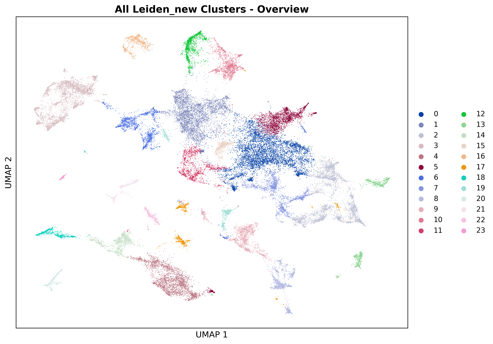

## Code Summary: 4_plot_individual_leiden_clusters.py

UMAP visualizations for individual Leiden clusters from merged spatial transcriptomics data. \

### Outputs

**Main Output Directory**: `MERGE_SPATIAL_DATA/plots_individual_leiden_clusters/`

1. **Grid Visualization**:
   - `individual_leiden_clusters_grid.png` - Multi-panel grid showing all clusters
   - Organized in rows and columns for easy comparison
   - Each panel highlights one cluster against others

2. **Individual Cluster Files**:
   - `leiden_cluster_{X}_individual.png` - Separate file for each cluster X
   - High-resolution detailed view of each cluster
   - Includes legend and proper labeling

3. **Overview Plot**:
   - `all_leiden_clusters_overview.png` - All clusters colored simultaneously
   - Shows complete clustering structure
   - Useful for understanding overall cluster distribution
        
               
### Visualizations

#### Individual leiden clusters

#### All leiden clusters

