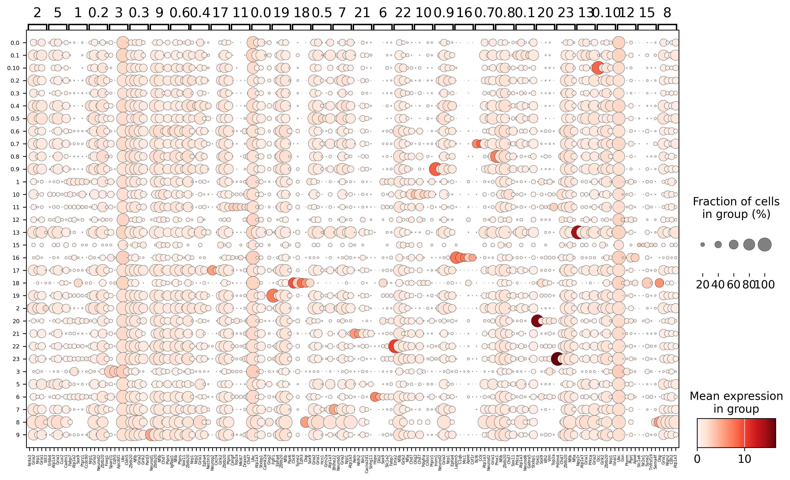
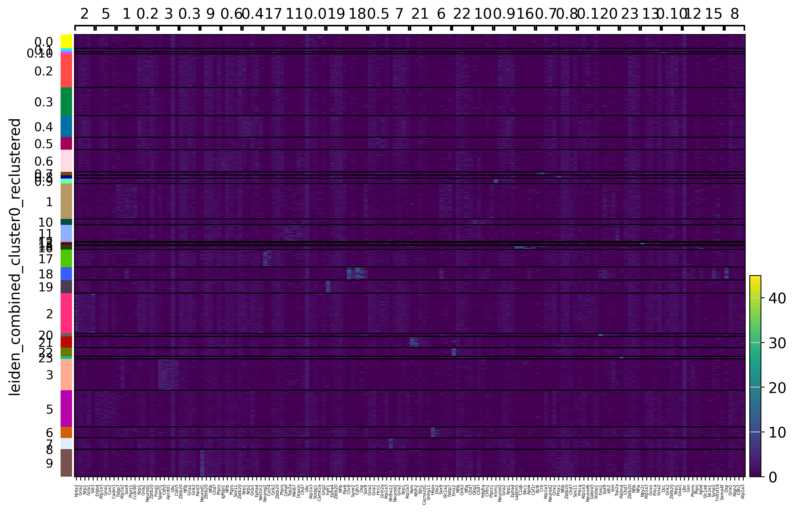
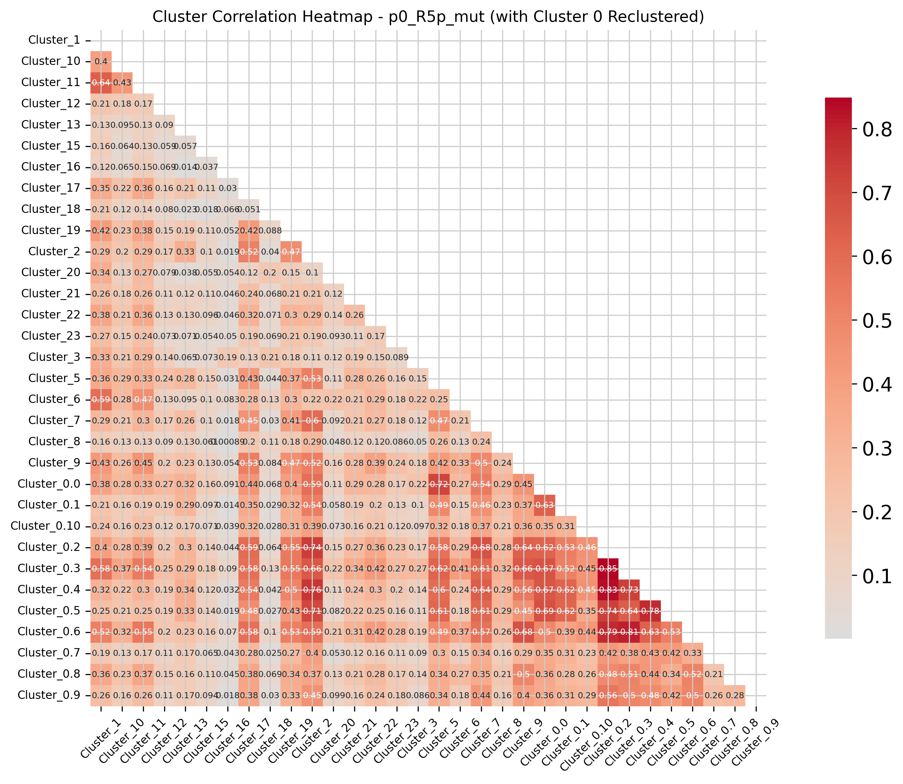
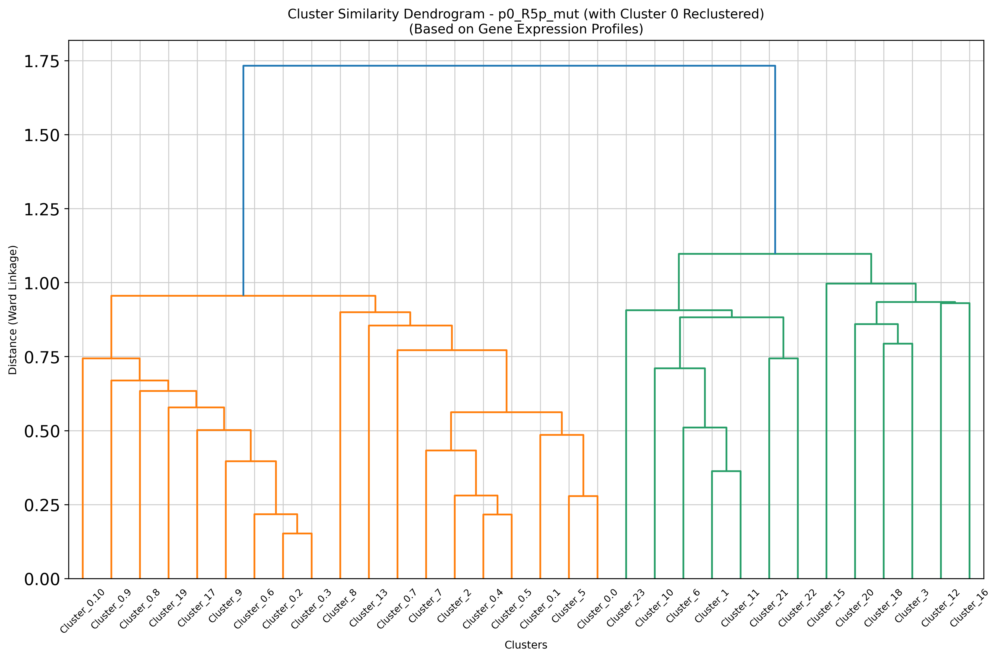
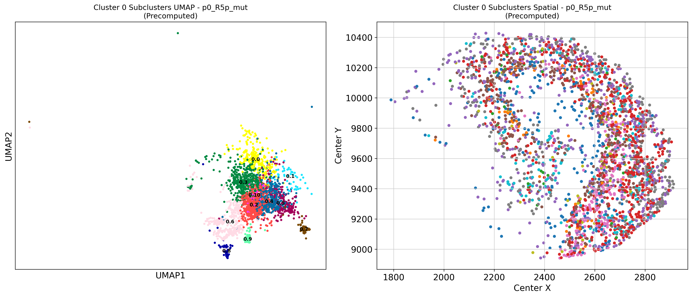
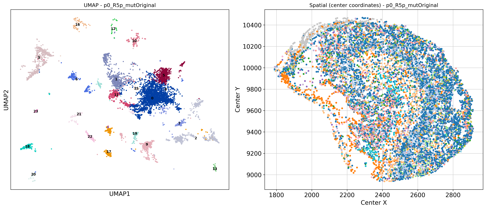
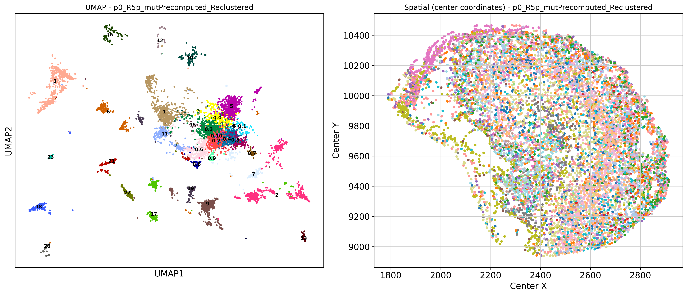

## Code Summary: 3_marker_genes_per_sample.py

Marker gene analysis on spatial transcriptomics data using precomputed cluster 0 reclustering results. 
It processes multiple samples individually and generates visualizations and statistical analyses for each sample.

## Outputs Generated

### Per Sample Outputs (`sample_{sample_id}/`)
Each sample gets its own subdirectory containing:
- `marker_genes.csv` - Complete differential expression results with statistics
- `top_30_marker_genes.csv` - Top marker genes per cluster summary
- **Visualization Files**:
  - `{sample_id}_Original_umap_spatial.png` - Original clustering plots
  - `{sample_id}_Precomputed_Reclustered_umap_spatial.png` - Enhanced clustering plots
  - `{sample_id}_subclusters_umap_spatial.png` - Cluster 0 subclusters subset
  - `heatmap_{sample_id}_marker_genes.png` - Top 5 marker genes heatmap
  - `dotplot_{sample_id}_marker_genes.png` - Top 5 marker genes dotplot
  - `{sample_id}_cluster_dendrogram.png` - Hierarchical clustering dendrogram
  - `{sample_id}_cluster_correlation.png` - Cluster correlation heatmap
  - `{sample_id}_correlation_matrix.csv` - Correlation matrix data

### Overall Outputs
- `overall_sample_statistics_with_cluster0_reclustering.csv` - Comprehensive sample statistics
- `overall_summary_with_cluster0_reclustering.txt` - Detailed analysis report with parameters
- Output directory: `MERGE_SPATIAL_DATA/marker_genes_per_sample_inclusive_cluster0_recluster/`

## Analysis Parameters and Methods
- **Differential Expression**: Wilcoxon rank-sum test
- **Marker Genes**: 50 genes per cluster (top 30 displayed)
- **Distance Metric**: Correlation distance for clustering
- **Linkage Method**: Ward linkage for dendrogram construction
- **Minimum Threshold**: >1 cell per cluster for DE analysis
        
### Sample Analysis Visualizations

#### Marker Gene Expression

#### Cluster Analysis

#### Spatial Analysis

