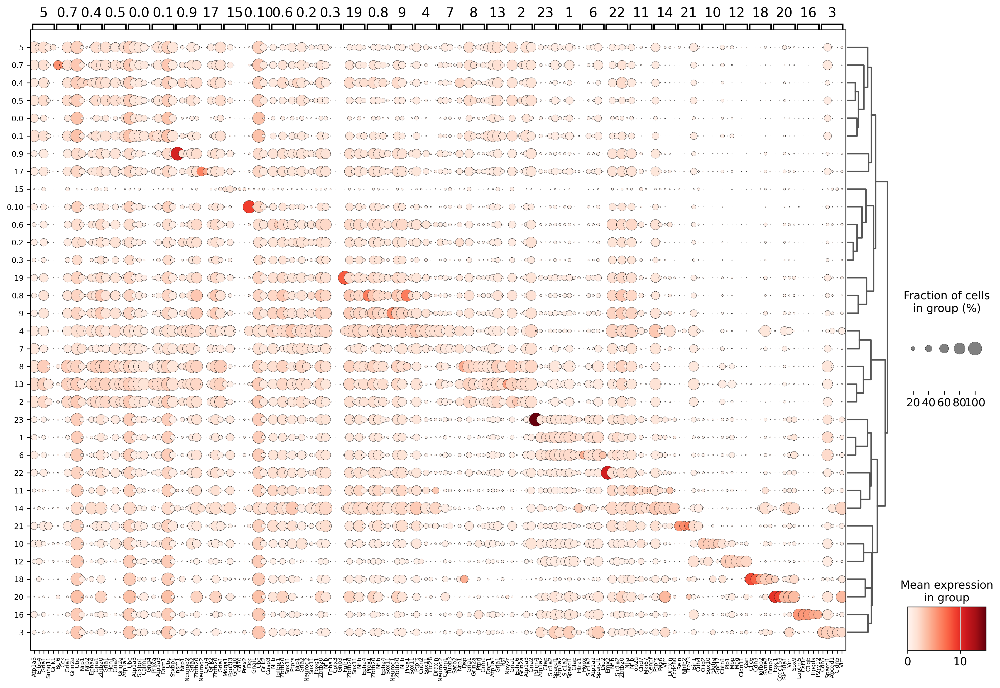

# Summary: 1_correlation_analysis.py

This script performs **correlation analysis with cluster 0 reclustering** on merged spatial transcriptomics data. It specifically focuses on reclustering all cluster 0 cells across all samples combined, then conducts correlation and differential expression analysis on the resulting clusters.

## Outputs

### Visualization Files
1. **UMAP_full.png** - Side-by-side UMAP plots (clusters vs samples)
2. **heatmap_marker_genes.png** - Top 5 marker genes per cluster heatmap
3. **dotplot_marker_genes.png** - Marker genes expression dotplot
4. **dendrogram.png** - Hierarchical clustering dendrogram of clusters
5. **clusters_correlation.png** - Cluster correlation heatmap
6. **cluster_cell_count_heatmap.png** - Cell count distribution across samples
7. **cluster_percentage_heatmap.png** - Percentage distribution across samples

### Data Export Files
1. **marker_genes.csv** - Complete differential expression results (100 genes per cluster)
2. **top_50_marker_genes.csv** - Top 50 marker genes per cluster summary
3. **clusters_correlation.csv** - Correlation matrix data
4. **cluster_composition_across_samples.csv** - Detailed composition analysis
5. **merged_data_with_combined_cluster0_reclustering.h5ad** - Updated AnnData object

### Analysis Report
- **analysis_summary.txt** - Comprehensive summary with statistics and parameters
        
        
### Visualizations

#### Cell Distribution Analysis

#### Cluster Analysis

#### Gene Expression Analysis

#### UMAP Visualization

