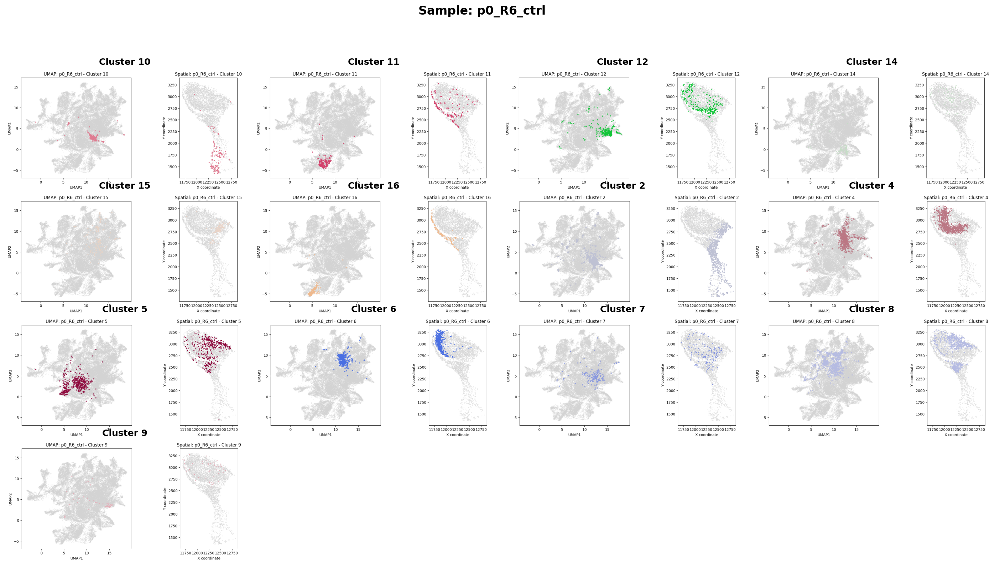

# Merged Spatial Data Analysis - Hippocampus


## Sample Collages

### e16_R1_mut


### e16_R2_ctrl


### p0_R5p_mut


### p0_R6_ctrl


### p7_R1_mut


### p7_R2_ctrl


### p30_R3_mut


### p30_R4p_ctrl


### Output Directories
- `plots_hippo_standard/` - Initial QC and overview plots
- `plots_hippo_cluster_highlight_standard/` - Individual cluster plots for each sample
- `sample_collages_standard/` - Collage images showing all clusters per sample

## Methods

Each collage displays all clusters (with >50 cells) for a given sample, showing both:
- **UMAP plot**: Global UMAP embedding from merged dataset with highlighted cluster cells
- **Spatial plot**: Original spatial coordinates with highlighted cluster cells- `DATA/{time_group}/{region}/adata_by_region_new.h5ad` - Individual sample data files

**Output Files**:
- Console output showing ROI assignment distribution and filtering statistics.
- Detailed analysis of which cells would be kept vs. filtered out.

**Key Features**:
- Analyzes `roi_assignment` column distribution.
- Calculates percentage of cells that would be filtered out.
- Identifies all unique ROI assignment values.
- Provides recommendations for fixing cell loss.


# SRF Spatial Data Analysis Pipelines Documentation

## Table of Contents
1. [Overview](#overview)
2. [Workflow Dependencies](#workflow-dependencies)
3. [Script Documentation](#script-documentation)
    - [merge_hippo_standard.py](#merge_hippo_standardpy)
    - [hippo_analysis_standard.py](#hippo_analysis_standardpy)
    - [marker_genes_per_sample_standard.py](#marker_genes_per_sample_standardpy)
    - [merge_hippo_inclusive.py](#merge_hippo_inclusivepy)
    - [hippo_analysis_inclusive.py](#hippo_analysis_inclusivepy)
    - [marker_genes_per_sample_inclusive.py](#marker_genes_per_sample_inclusivepy)
    - [merge_hippo_extended.py](#merge_hippo_extendedpy)
    - [hippo_analysis_extended.py](#hippo_analysis_extendedpy)
    - [marker_genes_per_sample_extended.py](#marker_genes_per_sample_extendedpy)
    - [create_extended_roi_dataset.py](#create_extended_roi_datasetpy)
    - [diagnose_missing_cells.py](#diagnose_missing_cellspy)
    - [merge_hippo_fixed.py](#merge_hippo_fixedpy)
    - [merge_full_slide.py](#merge_full_slidepy)
    - [umap_parameter_optimization.py](#umap_parameter_optimizationpy)
    - [create_umap_parameter_collages.py](#create_umap_parameter_collagespy)
    - [create_sample_collages.py](#create_sample_collagespy)
4. [Pipeline Execution Guide](#pipeline-execution-guide)
    - [Prerequisites](#prerequisites)
    - [Quick Start](#quick-start)
    - [Workflow A: Standard Pipeline (Filtered Analysis)](#workflow-a-standard-pipeline-filtered-analysis)
    - [Workflow B: Extended Pipeline (With Cluster Extensions) ⭐ RECOMMENDED](#workflow-b-extended-pipeline-with-cluster-extensions--recommended)
    - [Workflow C: Inclusive Pipeline (All Clusters, ROI Only)](#workflow-c-inclusive-pipeline-all-clusters-roi-only)
5. [Pipeline Comparison](#pipeline-comparison)
6. [Diagnostics (Optional but Recommended)](#diagnostics-optional-but-recommended)
7. [Troubleshooting](#troubleshooting)
8. [Output Interpretation](#output-interpretation)
9. [File Structure](#file-structure)
10. [Summary and Recommendations](#summary-and-recommendations)

---

## Overview

This collection of scripts implements a spatial transcriptomics analysis pipeline that:
- Merges spatial data from multiple samples and regions.
- Performs clustering and dimensionality reduction.
- Optimizes UMAP parameters for visualization (optional).
- Conducts differential expression analysis.
- Creates visualization collages and reports.

The pipelines offer different strategies for handling cell clusters, particularly those with fewer than 50 cells in selected Regions of Interest (ROIs).


---

## Script Documentation

### merge_hippo_standard.py

**Purpose**: Merges spatial data from hippocampus regions across different samples and time points, filtering cells to only include those with `roi_assignment == "hippo"`.

**Input Files**:
- `DATA/{time_group}/{region}/adata_by_region_new.h5ad` - Individual sample data files

**Output Files**:
- `MERGE_SPATIAL_DATA/merged_spatial_data_hippo_standard.h5ad` - Merged hippocampus data
- `MERGE_SPATIAL_DATA/plots_hippo_new_standard/` - QC and visualization plots (UMAP, violin plots)

**Key Parameters**:
- Data mapping structure defining time points, regions, and sample types (mut/ctrl)
- UMAP parameters: `min_dist=0.1`, `spread=1.0`, `gamma=2.0`
- Leiden clustering: `resolution=0.5`
- Neighbor graph: `n_neighbors=15`, `n_pcs=40`

---

### hippo_analysis_standard.py

**Purpose**: Performs analysis of hippocampus data, creating plots that highlight individual clusters, but **filtering out clusters based on cell count (less than 50 cells)**.

**Input Files**:
- `MERGE_SPATIAL_DATA/merged_spatial_data_hippo_standard.h5ad`

**Output Files**:
- `MERGE_SPATIAL_DATA/plots_hippo_cluster_highlight_standard/` - Individual cluster plots and sample-specific spatial plots
  - `sample_{sample_id}_cluster_{cluster_id}.png` - Dual plots (UMAP + Spatial) for each sample-cluster combination
  - `spatial_leiden_by_sample_{sample_id}.png` - Separate spatial scatter plot for each sample, colored by Leiden clusters.
- `MERGE_SPATIAL_DATA/plots_hippo_cluster_highlight_standard/standard_analysis_summary.txt` - Summary report.

**Plot Features**:
- **Dual Plot Format**: Each plot shows both UMAP and spatial coordinates.
- **Cluster Highlighting**: Target cluster highlighted in color, others in gray.
- **Filtering**: Only processes clusters with >50 cells.
- **Consistent Coloring**: Uses Leiden cluster color scheme.

---

### marker_genes_per_sample_standard.py

**Purpose**: Performs differential expression analysis and cluster similarity analysis for each sample, **filtering out clusters based on cell count (less than 50 cells)**.

**Input Files**:
- `MERGE_SPATIAL_DATA/merged_spatial_data_hippo_standard.h5ad`

**Output Files**:
For each sample, creates a subdirectory `MERGE_SPATIAL_DATA/marker_genes_per_sample_standard/sample_{sample_id}/`:
- `marker_genes.csv` - Complete differential expression results (50 genes per cluster)
- `top_10_marker_genes.csv` - Top 10 marker genes per cluster summary
- `heatmap_{sample_id}_marker_genes_heatmap.png` - Expression heatmap (top 5 genes per cluster)
- `dotplot_{sample_id}_marker_genes_dotplot.png` - Marker genes dotplot
- `{sample_id}_cluster_dendrogram.png` - Hierarchical clustering dendrogram
- `{sample_id}_cluster_correlation.png` - Cluster correlation heatmap
- `{sample_id}_correlation_matrix.csv` - Numerical correlation matrix
- `{sample_id}_summary.txt` - Analysis summary report
- `MERGE_SPATIAL_DATA/marker_genes_per_sample_standard/overall_sample_statistics.csv` - Cross-sample statistics
- `MERGE_SPATIAL_DATA/marker_genes_per_sample_standard/overall_analysis_summary.txt` - Complete analysis overview

**Analysis Parameters**:
- **Differential Expression**: Wilcoxon rank-sum test
- **Minimum Cluster Size**: 50 cells (clusters below this are filtered out)
- **Genes per Cluster**: 50 marker genes
- **Distance Metric**: Correlation distance
- **Linkage Method**: Ward linkage

---

### merge_hippo_inclusive.py

**Purpose**: Merges spatial data from hippocampus regions across different samples and time points. It filters cells to only include those with `roi_assignment == "hippo"`, similar to the standard pipeline, but prepares the data for subsequent analysis where **no cluster size filtering will occur**.

**Input Files**:
- `DATA/{time_group}/{region}/adata_by_region_new.h5ad` - Individual sample data files

**Output Files**:
- `MERGE_SPATIAL_DATA/merged_spatial_data_hippo_inclusive.h5ad` - Merged hippocampus data for inclusive analysis
- `MERGE_SPATIAL_DATA/plots_hippo_inclusive/` - QC and visualization plots (UMAP, violin plots)

**Key Parameters**:
- Data mapping structure defining time points, regions, and sample types (mut/ctrl)
- UMAP parameters: `min_dist=0.1`, `spread=1.0`, `gamma=2.0`
- Leiden clustering: `resolution=0.5`
- Neighbor graph: `n_neighbors=15`, `n_pcs=40`

---

### hippo_analysis_inclusive.py

**Purpose**: Performs analysis of hippocampus data, creating plots that highlight individual clusters, **without filtering out clusters based on cell count**.

**Input Files**:
- `MERGE_SPATIAL_DATA/merged_spatial_data_hippo_inclusive.h5ad`

**Output Files**:
- `MERGE_SPATIAL_DATA/plots_hippo_cluster_highlight_inclusive/` - Individual cluster plots and sample-specific spatial plots
  - `sample_{sample_id}_cluster_{cluster_id}.png` - Dual plots (UMAP + Spatial) for each sample-cluster combination
  - `spatial_leiden_by_sample_{sample_id}.png` - Separate spatial scatter plot for each sample, colored by Leiden clusters.
- `MERGE_SPATIAL_DATA/plots_hippo_cluster_highlight_inclusive/inclusive_analysis_summary.txt` - Summary report.

**Plot Features**:
- **Dual Plot Format**: Each plot shows both UMAP and spatial coordinates.
- **Cluster Highlighting**: Target cluster highlighted in color, others in gray.
- **No Filtering**: Processes ALL clusters, regardless of cell count.
- **Consistent Coloring**: Uses Leiden cluster color scheme.

---

### marker_genes_per_sample_inclusive.py

**Purpose**: Performs differential expression analysis and cluster similarity analysis for each sample, **without filtering out clusters based on cell count**.

**Input Files**:
- `MERGE_SPATIAL_DATA/merged_spatial_data_hippo_inclusive.h5ad`

**Output Files**:
For each sample, creates a subdirectory `MERGE_SPATIAL_DATA/marker_genes_per_sample_inclusive/sample_{sample_id}/`:
- `marker_genes.csv` - Complete differential expression results (50 genes per cluster)
- `top_10_marker_genes.csv` - Top 10 marker genes per cluster summary
- `heatmap_{sample_id}_marker_genes_heatmap.png` - Expression heatmap (top 5 genes per cluster)
- `dotplot_{sample_id}_marker_genes_dotplot.png` - Marker genes dotplot
- `{sample_id}_cluster_dendrogram.png` - Hierarchical clustering dendrogram
- `{sample_id}_cluster_correlation.png` - Cluster correlation heatmap
- `{sample_id}_correlation_matrix.csv` - Numerical correlation matrix
- `{sample_id}_summary.txt` - Analysis summary report
- `MERGE_SPATIAL_DATA/marker_genes_per_sample_inclusive/overall_sample_statistics.csv` - Cross-sample statistics
- `MERGE_SPATIAL_DATA/marker_genes_per_sample_inclusive/overall_analysis_summary.txt` - Complete analysis overview

**Analysis Parameters**:
- **Differential Expression**: Wilcoxon rank-sum test
- **Minimum Cluster Size**: None (all clusters are included)
- **Genes per Cluster**: 50 marker genes
- **Distance Metric**: Correlation distance
- **Linkage Method**: Ward linkage

---

### merge_hippo_extended.py

**Purpose**: Merges spatial data from hippocampus regions across different samples and time points, similar to `merge_hippo_standard.py`, but outputs to a new file (`merged_spatial_data_hippo_all_cells.h5ad`) to support the extended analysis workflow. This script explicitly keeps all cells from the ROI selection, without filtering by `roi_assignment == "hippo"`.

**Input Files**:
- `DATA/{time_group}/{region}/adata_by_region_new.h5ad` - Individual sample data files

**Output Files**:
- `MERGE_SPATIAL_DATA/merged_spatial_data_hippo_all_cells.h5ad` - Merged hippocampus data for extended analysis
- `MERGE_SPATIAL_DATA/plots_hippo_extended/` - QC and visualization plots (similar to original but in a new directory)

**Key Parameters**:
- Same as `merge_hippo_standard.py`

---

### hippo_analysis_extended.py

**Purpose**: Performs analysis of hippocampus data, creating plots that highlight individual clusters, without filtering out clusters based on cell count. This script is designed to work with the pre-extended dataset.

**Input Files**:
- `MERGE_SPATIAL_DATA/merged_spatial_data_hippo_extended.h5ad` - Extended ROI dataset with cluster extensions

**Output Files**:
- `MERGE_SPATIAL_DATA/plots_hippo_cluster_highlight_extended/` - Individual cluster plots and sample-specific spatial plots
  - `sample_{sample_id}_cluster_{cluster_id}.png` - Dual plots (UMAP + Spatial) for each sample-cluster combination
  - `spatial_leiden_by_sample_{sample_id}.png` - Separate spatial scatter plot for each sample, colored by Leiden clusters.
- `MERGE_SPATIAL_DATA/plots_hippo_cluster_highlight_extended/cluster_extension_summary.txt` - Summary report.

**Plot Features**:
- **Dual Plot Format**: Each plot shows both UMAP and spatial coordinates.
- **Cluster Highlighting**: Target cluster highlighted in color, others in gray.
- **No Filtering**: Processes ALL clusters, regardless of cell count.
- **Consistent Coloring**: Uses Leiden cluster color scheme.
- **Sample-specific Spatial Plots**: Generates a dedicated spatial scatter plot for each sample.
- **Extension Concept Visualization**: UMAP plots for extended clusters illustrate the inclusion of cells from other samples.

---

### marker_genes_per_sample_extended.py

**Purpose**: Performs differential expression analysis and cluster similarity analysis for each sample using the pre-extended dataset.

**Input Files**:
- `MERGE_SPATIAL_DATA/merged_spatial_data_hippo_extended.h5ad` - Extended ROI dataset where small clusters have already been augmented

**Output Files**:
For each sample, creates a subdirectory `MERGE_SPATIAL_DATA/marker_genes_per_sample_extended/sample_{sample_id}/`:
- `marker_genes.csv` - Complete differential expression results (50 genes per cluster)
- `top_10_marker_genes.csv` - Top 10 marker genes per cluster summary
- `heatmap_{sample_id}_marker_genes_heatmap.png` - Expression heatmap (top 5 genes per cluster)
- `dotplot_{sample_id}_marker_genes_dotplot.png` - Marker genes dotplot
- `{sample_id}_cluster_dendrogram.png` - Hierarchical clustering dendrogram
- `{sample_id}_cluster_correlation.png` - Cluster correlation heatmap
- `{sample_id}_correlation_matrix.csv` - Numerical correlation matrix
- `{sample_id}_summary.txt` - Analysis summary report
- `MERGE_SPATIAL_DATA/marker_genes_per_sample_extended/overall_sample_statistics.csv` - Cross-sample statistics
- `MERGE_SPATIAL_DATA/marker_genes_per_sample_extended/overall_analysis_summary.txt` - Complete analysis overview

**Analysis Parameters**:
- **Differential Expression**: Wilcoxon rank-sum test
- **Genes per Cluster**: 50 marker genes
- **Distance Metric**: Correlation distance
- **Linkage Method**: Ward linkage
- **Key Change**: Uses pre-extended dataset; no internal cluster extension.

---

### create_extended_roi_dataset.py

**Purpose**: Creates a dataset-level cluster extension by adding cells from clusters that are small (fewer than 50 cells) in ANY individual sample. This implements the core cluster extension logic at the dataset preparation stage.

**Input Files**:
- `MERGE_SPATIAL_DATA/merged_spatial_data_hippo_all_cells.h5ad` - Fixed merged data preserving all ROI cells

**Configuration**:
- `MIN_CLUSTER_SIZE = 50` - Threshold for identifying small clusters requiring extension.
- Per-sample cluster analysis - finds clusters with <50 cells in ANY individual sample.

**Logic**:
1. Analyzes cluster sizes per sample in ROI selection (not total across samples).
2. Identifies clusters with <50 cells in ANY sample for extension.
3. Loads original data from each sample to find additional cells.
4. Adds ALL cells from those clusters back to the ROI dataset.
5. Creates extended dataset with both ROI cells and additional cluster cells.

**Output Files**:
- `MERGE_SPATIAL_DATA/merged_spatial_data_hippo_extended.h5ad` - Extended ROI dataset
- Console output showing: per-sample cluster size analysis, clusters requiring extension, extension summary with before/after counts.

**Key Features**:
- **Per-Sample Analysis**: Finds clusters small in individual samples, not dataset totals.
- **Avoids Duplicates**: Excludes cells already in ROI selection.
- **Detailed Reporting**: Shows extension impact per sample and cluster.
- **Dataset-Level Extension**: Creates persistent extended dataset for all subsequent analyses.

**Problem Solved**: Provides statistical power to small clusters by including all cells from those clusters across the entire dataset, while maintaining sample-specific analysis for large clusters.

---

### diagnose_missing_cells.py

**Purpose**: Diagnostic script to identify and analyze cell loss during ROI filtering in the merge process.

**Input Files**:
- `DATA/{time_group}/{region}/adata_by_region_new.h5ad` - Individual sample data files

**Output Files**:
- Console output showing ROI assignment distribution and filtering statistics.
- Detailed analysis of which cells would be kept vs. filtered out.

**Key Features**:
- Analyzes `roi_assignment` column distribution.
- Calculates percentage of cells that would be filtered out.
- Identifies all unique ROI assignment values.
- Provides recommendations for fixing cell loss.

---

### merge_full_slide.py

**Purpose**: Merges spatial data from entire slide regions (alternative to hippocampus-only analysis).

**Input Files**:
- `DATA/{time_group}/{region}/data.h5ad` - Full slide data files

**Output Files**:
- `MERGE_SPATIAL_DATA/merged_spatial_data_full_slide.h5ad` - Merged full slide data
- `MERGE_SPATIAL_DATA/plots_full_slide/` - QC and analysis plots

**Key Parameters**:
- Similar processing pipeline to `merge_hippo_standard.py` but includes all regions.
- Standard UMAP parameters and neighbor graph construction.

---

### umap_parameter_optimization.py

**Purpose**: Systematically tests different UMAP parameter combinations to find optimal visualization parameters.

**Input Files**:
- `MERGE_SPATIAL_DATA/merged_spatial_data_hippo_standard.h5ad` (Note: This input file name might need to be updated depending on which merge script is used as a precursor for optimization).

**Output Files**:
- `MERGE_SPATIAL_DATA/umap_optimization/plots/{param_combination}/` - Individual UMAP plots.
- `MERGE_SPATIAL_DATA/umap_optimization/summary/` - Analysis summaries.

**Parameter Grid**:
- `min_dist`: [0.01, 0.1, 0.3, 0.5, 0.8]
- `spread`: [0.5, 1.0, 1.5, 2.0]
- `gamma`: [1.0, 2.0, 5.0, 10.0]
- Total combinations: 5 × 4 × 4 = 80

**Quality Metrics**:
- **Total Spread**: Sum of X and Y coordinate ranges.
- **Neighborhood Preservation**: Overlap between original and UMAP space neighbors.
- **Cluster Separation**: Average distance between cluster centroids.
- **Runtime**: Processing time for each parameter combination.

---

### create_umap_parameter_collages.py

**Purpose**: Creates organized collages showing UMAP results with different parameter combinations.

**Input Files**:
- `MERGE_SPATIAL_DATA/umap_optimization/plots/` - Individual UMAP plots.
- `MERGE_SPATIAL_DATA/umap_optimization/summary/umap_parameter_optimization_results.csv`

**Output Files**:
- `MERGE_SPATIAL_DATA/umap_parameter_collages/` - Collage visualizations.

**Visualization Features**:
- **Parameter Grid Collages**: Organized by gamma values with min_dist × spread grids.
- **Best Parameters Collage**: Shows top combinations based on: best neighborhood preservation, best total spread, best balanced score (60% preservation + 40% spread), and representative parameter sets.

---

### create_sample_collages.py

**Purpose**: Creates organized collages showing all cluster plots for each sample.

**Input Files**:
- `MERGE_SPATIAL_DATA/plots_hippo_cluster_highlight_new_rois/sample_*.png` (Note: This input path might need to be updated depending on which `hippo_analysis_*.py` script was run).

**Output Files**:
- `MERGE_SPATIAL_DATA/sample_collages_standard/` - Sample-specific collages.

**Layout Features**:
- **Automatic Grid Sizing**: Calculates optimal grid dimensions (roughly square).
- **Cluster Labeling**: Each subplot labeled with cluster number.
- **Sample Organization**: Separate collage for each sample.
- **Clean Layout**: Minimal spacing and consistent formatting.

-- 

### Quick Start

```bash
# To run the Standard Pipeline:
sbatch run_pipeline_standard.sh

# To run the Extended Pipeline (Recommended for robust statistics):
sbatch run_pipeline_extended.sh

# To run the Inclusive Pipeline (Recommended for complete ROI analysis):
sbatch run_pipeline_inclusive.sh
```

### Workflow A: Standard Pipeline (Filtered Analysis)

**Use this when**: You want to analyze only cells within ROI boundaries and exclude clusters with <50 cells per sample. This workflow provides high statistical rigor for the analyzed clusters.

**Execution**:
```bash
sbatch run_pipeline_standard.sh
```

**Features**:
- ✅ Analyzes clusters with ≥50 cells per sample only.
- ✅ High statistical rigor for analyzed clusters.
- ✅ Uses only ROI-selected cells.
- ❌ Excludes potentially interesting small clusters.

**Outputs**:
- `merged_spatial_data_hippo_standard.h5ad`
- `plots_hippo_cluster_highlight_standard/`
- `marker_genes_per_sample_standard/`

---

### Workflow B: Extended Pipeline (With Cluster Extensions)

**Use this when**: You want robust statistical analysis for all clusters, including small ones, by extending them with cells from the same cluster across the entire dataset.

**Execution**:
```bash
sbatch run_pipeline_extended.sh
```

**Features**:
- ✅ Analyzes ALL clusters (no size filtering).
- ✅ Enhanced statistical power for small clusters.
- ✅ Comprehensive marker gene profiles.
- ⚠️ Uses additional cells beyond ROI boundaries for small clusters.

**Outputs**:
- `merged_spatial_data_hippo_all_cells.h5ad` (initial merge)
- `merged_spatial_data_hippo_extended.h5ad` (extended dataset)
- `plots_hippo_cluster_highlight_extended/`
- `marker_genes_per_sample_extended/`

---

### Workflow C: Inclusive Pipeline (All Clusters, ROI Only)

**Use this when**: You want to analyze ALL clusters using only ROI-selected cells, regardless of cluster size. This workflow maintains strict spatial boundaries.

**Execution**:
```bash
sbatch run_pipeline_inclusive.sh
```

**Features**:
- ✅ Analyzes ALL clusters from the 'hippo' ROI.
- ✅ No cluster size filtering.
- ✅ Provides a complete picture of all cell populations in the ROI.
- ⚠️ Small clusters (<50 cells) are analyzed, but may have limited statistical power.

**Outputs**:
- `merged_spatial_data_hippo_inclusive.h5ad`
- `plots_hippo_cluster_highlight_inclusive/`
- `marker_genes_per_sample_inclusive/`

---

## Diagnostics

Diagnostic code to understand cell loss during ROI filtering and cluster distribution.

```bash
# Basic diagnostic (single sample)
sbatch run_diagnose_missing_cells.sh

# Comprehensive diagnostic (all samples)
sbatch run_diagnose_full_pipeline.sh
```

**This tells you**:
- How many cells are in your ROI selections.
- How many cells would be lost by filtering.
- Whether you need extensions for small clusters.

---

## Output Interpretation

### Key Output Files:

#### Merged Datasets:
- `MERGE_SPATIAL_DATA/merged_spatial_data_hippo_standard.h5ad` - Standard pipeline merged data (ROI cells, `roi_assignment == "hippo"` filtered).
- `MERGE_SPATIAL_DATA/merged_spatial_data_hippo_inclusive.h5ad` - Inclusive pipeline merged data (ROI cells, `roi_assignment == "hippo"` filtered).
- `MERGE_SPATIAL_DATA/merged_spatial_data_hippo_all_cells.h5ad` - Initial merge for Extended pipeline (all ROI cells, no `roi_assignment` filter).
- `MERGE_SPATIAL_DATA/merged_spatial_data_hippo_extended_rois.h5ad` - Extended pipeline dataset (ROI + augmented small clusters).
- `MERGE_SPATIAL_DATA/merged_spatial_data_full_slide.h5ad` - Full slide analysis merged data (if `merge_full_slide.py` is used).

#### Spatial Plots:
- `plots_hippo_cluster_highlight_standard/` - Standard pipeline individual cluster visualizations.
- `plots_hippo_cluster_highlight_inclusive/` - Inclusive pipeline individual cluster visualizations.
- `plots_hippo_cluster_highlight_extended/` - Extended pipeline individual cluster visualizations.
- Each plot typically shows UMAP (left) + spatial coordinates (right) for individual clusters.

#### Marker Gene Results:
- `marker_genes_per_sample_standard/sample_{id}/marker_genes.csv` - Standard pipeline full differential expression results.
- `marker_genes_per_sample_inclusive/sample_{id}/marker_genes.csv` - Inclusive pipeline full differential expression results.
- `marker_genes_per_sample_extended/sample_{id}/marker_genes.csv` - Extended pipeline full differential expression results.
- `*heatmap*.png` - Expression heatmaps (e.g., `heatmap_{sample_id}_marker_genes_heatmap.png`).
- `*dotplot*.png` - Marker gene dotplots (e.g., `dotplot_{sample_id}_marker_genes_dotplot.png`).
- `*dendrogram*.png` - Cluster similarity trees (e.g., `{sample_id}_cluster_dendrogram.png`).
- `*correlation*.png` - Cluster correlation heatmaps (e.g., `{sample_id}_cluster_correlation.png`).
- Summary reports (`*summary.txt`) and overall statistics (`overall_sample_statistics.csv`, `overall_analysis_summary.txt`) are also generated in the respective output directories.

---

## File Structure

```
SRF_Spatial_segmentation/
├── MERGE_SPATIAL_DATA/
│   ├── README.md                                   # This consolidated documentation
│   ├── merged_spatial_data_hippo_standard.h5ad     # Standard pipeline output
│   ├── merged_spatial_data_hippo_inclusive.h5ad    # Inclusive pipeline output
│   ├── merged_spatial_data_hippo_all_cells.h5ad    # Extended pipeline initial merge output
│   ├── merged_spatial_data_hippo_extended_rois.h5ad# Extended pipeline final dataset
│   ├── merged_spatial_data_full_slide.h5ad         # Full slide analysis output
│   ├── plots_hippo_standard/                       # Standard merge QC plots
│   ├── plots_hippo_inclusive/                      # Inclusive merge QC plots
│   ├── plots_hippo_extendeed/                      # Extended merge QC plots
│   ├── plots_hippo_cluster_highlight_standard/     # Standard analysis plots
│   ├── plots_hippo_cluster_highlight_inclusive/    # Inclusive analysis plots
│   ├── plots_hippo_cluster_highlight_extended/     # Extended analysis plots
│   ├── plots_full_slide/                           # Full slide analysis plots
│   ├── sample_collages_standard/                   # Sample-specific collages (from original hippo_analysis)
│   ├── marker_genes_per_sample_standard/           # Standard analysis results
│   │   └── sample_{id}/
│   ├── marker_genes_per_sample_inclusive/          # Inclusive analysis results
│   │   └── sample_{id}/
│   ├── marker_genes_per_sample_extended/           # Extended analysis results
│   │   └── sample_{id}/
│   ├── umap_optimization/                          # UMAP parameter optimization results
│   │   ├── plots/
│   │   └── summary/
│   ├── umap_parameter_collages/                    # UMAP parameter collage visualizations
│   ├── SCRIPTS/
│   │   ├── merge_hippo_standard.py
│   │   ├── hippo_analysis_standard.py
│   │   ├── marker_genes_per_sample_standard.py
│   │   ├── merge_hippo_inclusive.py
│   │   ├── hippo_analysis_inclusive.py
│   │   ├── marker_genes_per_sample_inclusive.py
│   │   ├── merge_hippo_extended.py
│   │   ├── hippo_analysis_extended.py
│   │   ├── marker_genes_per_sample_extended.py
│   │   ├── create_extended_roi_dataset.py
│   │   ├── diagnose_missing_cells.py
│   │   ├── merge_full_slide.py
│   │   ├── umap_parameter_optimization.py
│   │   ├── create_umap_parameter_collages.py
│   │   └── create_sample_collages.py
│   ├── run_pipeline_standard.sh
│   ├── run_pipeline_inclusive.sh
│   ├── run_pipeline_extended.sh
│   ├── run_create_extended_roi_dataset.sh          # Script to run create_extended_roi_dataset.py
│   ├── run_merge_hippo_fixed.sh                    # Script to run merge_hippo_fixed.py
│   ├── run_diagnose_full_pipeline.sh               # Script to run comprehensive diagnostic
│   └── logs/
└── DATA/
    ├── p0-p7/
    │   └── R{x}/
    │       ├── data.h5ad
    │       └── adata_by_region_new.h5ad
    └── p30-E165/
        └── R{x}/
            ├── data.h5ad
            └── adata_by_region_new.h5ad
```